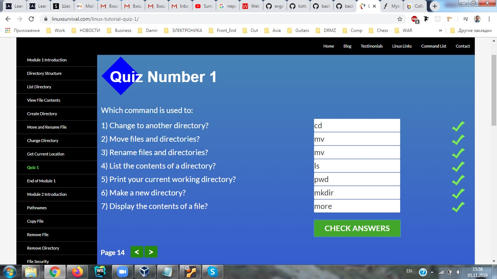
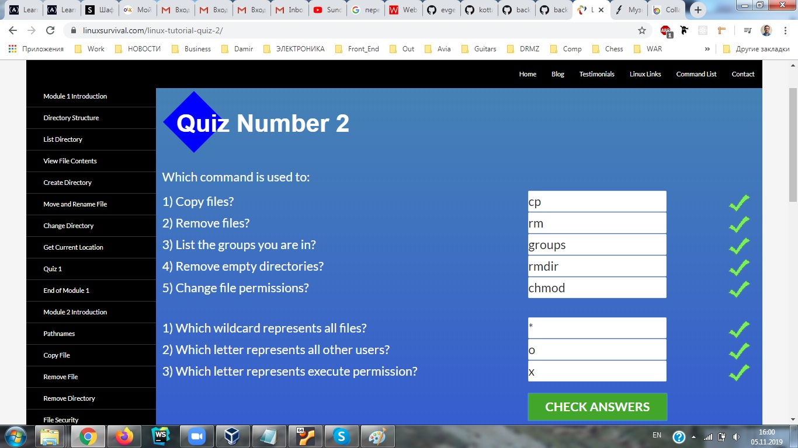
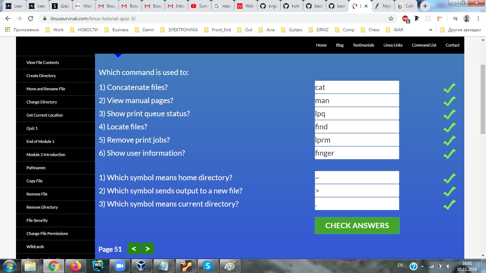
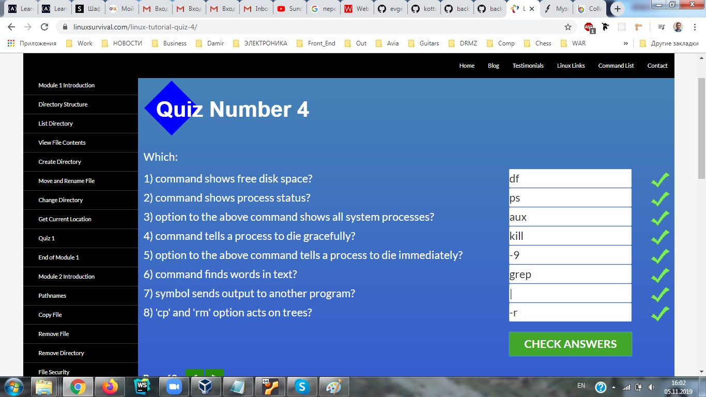
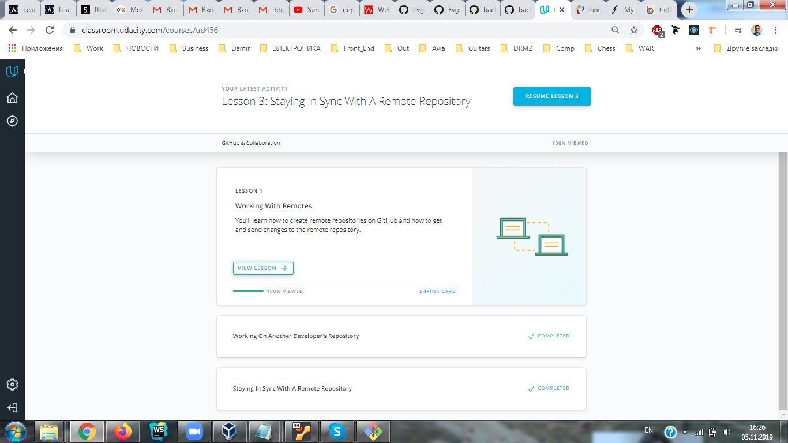

## Git and GitHub

Thanks to this material, I learned a lot about GIT
I continue to study, a lot of interesting things to come

## Unix Shell

Remembered many commands passing this course

## Git Collaboration

I like this! 

